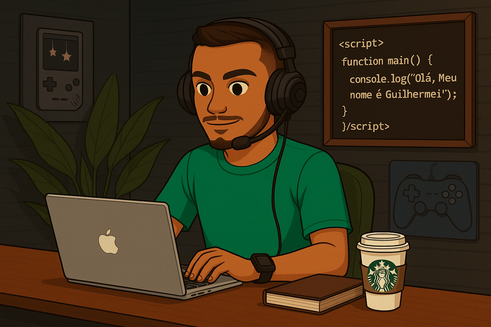

  
  

  <h3 align="left">📈 Estatísticas</h3>
   
  
  

<h3 align="left">📝 Sobre Mim</h3>

-  Olá, Meu nome é Guilherme Andrade, sou formado em Análise e Desenvolvimento de Sistemas, com interesse em tecnologia e programação.  
-  Tenho como objetivo iniciar minha carreira na área de desenvolvimento e evoluir como desenvolvedor Full Stack. 
-  Minha stack principal é Node.js no back-end, React no front-end, com bancos de dados MySQL. 
-  Sou movido por desafios e estou sempre em busca de aprimoramento. Procuro contribuir com soluções eficientes em projetos inovadores e colaborativos. 
- <a href="https://drive.google.com/file/d/1631SfjJFCHh7rSZaLCBXeW7mU4p-xyb9/view?usp=drive_link" target="_blank"><strong style="color: white;"> Clique aqui para ver meu currículo.</strong></a>

##

<h3 align="left">💻 Tecnologias</h3>

##

<h3 align="left">🌐 Conecte-se comigo</h3>

  

  

  

##

  <h3>Codificando e Aprendendo 🖥️📚</h3>
  

